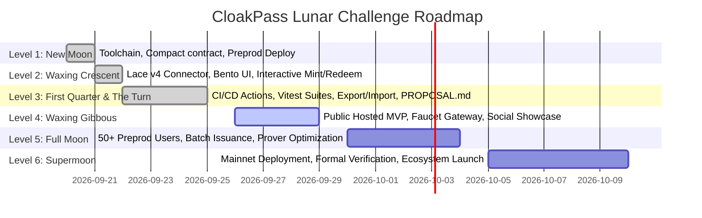

# CloakPass — Level 3 Project Proposal ("The Turn")

**Phase**: Level 3 (First Quarter) — Idea Submission ("The Turn")  
**Project Name**: CloakPass  
**Track / Category**: `Identity/credentials` (*Confidential Credentials & Private Allowlist Access*)  
**Selected Problem Statement**: Privacy-Preserving Access Control & Sybil-Resistant Verification (Proof of Entitlement Without Identity Exposure)  
**Live Preprod Contract**: [`02df1c9fa9e67e2dfd8a67b7e74ade0e615972a8f10e166e05648d6397df5f4cc9`](https://explorer.preprod.midnight.network/contract/02df1c9fa9e67e2dfd8a67b7e74ade0e615972a8f10e166e05648d6397df5f4cc9)  
**Live Hosted Web App**: [https://pranjal-debug.github.io/CloakPass/](https://pranjal-debug.github.io/CloakPass/) (Mirror: [https://cloak-pass.vercel.app/](https://cloak-pass.vercel.app/))  
**GitHub Repository**: [https://github.com/Pranjal-debug/CloakPass](https://github.com/Pranjal-debug/CloakPass)  
**Interactive Demo Video**: [Google Drive Demo Stream](https://drive.google.com/file/d/1-uUXTTpYOv8E8icx3NEAb6y4pIa36iab/view?usp=sharing)  

---

## Question 1: What problem does your dApp solve?

### The Problem in Web3
In contemporary Web3 ecosystems, access control, event ticketing, and gated access rely on public non-fungible tokens (NFTs) or account-based whitelists. While transparent ledgers guarantee verifiable ownership, they introduce severe privacy vulnerabilities:

1. **Surveillance & Doxxing**: Presenting a public wallet address to claim event admission, enter private physical spaces, or access confidential resources permanently connects the attendee's real-world physical location and off-chain identity with their complete on-chain financial transaction history and asset holdings.
2. **Transferability & Ticket Scalping**: Simple cryptographic signatures or public tokens allow illicit ticket resale, credential pooling, and credential sharing across unverified parties.
3. **Sybil Attacks in Gated Communities**: Without revealing personal identifiers, existing transparent blockchains struggle to prevent a single entity from claiming multiple allowances, airdrops, or private voting privileges.

### The CloakPass Solution
**CloakPass** is a production-grade, zero-knowledge access pass and entitlement verification protocol natively constructed on the **Midnight Network**. 

CloakPass enables attendees and credential holders to prove valid entitlement (e.g., event admission, DAO voting membership, API gate access) **without revealing their identity, their wallet address, or which specific ticket in the registry they own**. By leveraging Midnight's Compact smart contract language, client-side zero-knowledge proofs (ZKPs), and cryptographic single-use nullifiers, CloakPass eliminates double-redemption while preserving absolute anonymity.

---

## Question 2: What is your public state vs. private witness state, and what is disclosed?

CloakPass implements Midnight's dual-state execution model, creating an impenetrable boundary between client-side private witnesses and public ledger state:

### 1. Public Ledger State (On-Chain)
Maintained on the Midnight Preprod ledger and synchronized by indexers:
- **`passCommitments` (`HistoricMerkleTree<10, Bytes<32>>`)**: An append-only cryptographic Merkle tree storing commitment hashes of all issued passes (capacity: $2^{10} = 1,024$ leaves). Maintains root history to allow client-side off-chain proof generation without race conditions.
- **`usedNullifiers` (`Set<Bytes<32>>`)**: A persistent on-chain registry of consumed single-use nullifiers. If a nullifier already exists in this set, any redemption transaction aborts immediately, strictly preventing double-redemption.
- **`totalIssued` (`Counter`)**: Public metric tracking total credentials minted.
- **`totalRedeemed` (`Counter`)**: Public metric tracking total verified redemptions.
- **`organizerPk` (`Bytes<32>`)**: Authority key authorized to mint new credential commitments.

### 2. Private Witness State (Client-Side Off-Chain)
Stored strictly in the holder's browser memory / cold vault, never transmitted over the network:
- **`pass_secret` (`Bytes<32>`)**: High-entropy 256-bit random private key known only to the ticket holder.
- **`pass_salt` (`Bytes<32>`)**: High-entropy 256-bit cryptographic blinding salt preventing rainbow table precomputations.
- **`pass_path` (`MerklePath<10>`)**: Sibling node hashes proving the position of the leaf in `passCommitments`.

### 3. Deliberate Information Disclosure via `disclose()`
Midnight's `disclose()` primitive is applied strictly to prevent information leakage:
- **Disclosed**: `disclose(nullifier, true)` — The single-use nullifier `SHA-256("cloakpass:nullify:" || secret)` is disclosed to the ledger upon verification. This is the **only** piece of data revealed, enabling the contract to insert it into `usedNullifiers` and enforce single-use redemption.
- **Concealed (Zero Disclosure)**: The witness secret, blinding salt, holder wallet address, and Merkle leaf index are **never disclosed**. An observer on the Preprod explorer sees only that a valid Merkle proof occurred and that an unspent nullifier was inserted.

```
+-------------------------------------------------------------------------------+
|                             CLIENT PROVER (Off-Chain)                         |
|                                                                               |
|  [ Private Witnesses: pass_secret, pass_salt ]                                |
|         │                                                                     |
|         ├───> SHA-256("cloakpass:commit:" || secret || salt) = Leaf Hash      |
|         │                                                                     |
|         ├───> Query Merkle Membership Path in Ledger passCommitments Tree     |
|         │                                                                     |
|         └───> SHA-256("cloakpass:nullify:" || secret) = Single-Use Nullifier  |
|                                                                               |
|  [ ZK Prover Engine: Generates ZK Proof Proving Leaf Exists in Merkle Root]   |
+───────────────────────────────────────┬───────────────────────────────────────+
                                        │
                                        │ disclose(nullifier, true)
                                        ▼
+-------------------------------------------------------------------------------+
|                         MIDNIGHT LEDGER (On-Chain / Preprod)                  |
|                                                                               |
|  • passCommitments : HistoricMerkleTree<10, Bytes<32>>                        |
|  • usedNullifiers  : Set<Bytes<32>> (Single-Use Spend Registry)              |
|  • totalIssued     : Counter                                                  |
|  • totalRedeemed   : Counter                                                  |
|                                                                               |
|  Ledger Constraints:                                                          |
|  1. Merkle Membership verified against historical tree roots                  |
|  2. assert(!usedNullifiers.member(nullifier), "Double-Redemption Prohibited") |
|  3. usedNullifiers.insert(nullifier)                                          |
+-------------------------------------------------------------------------------+
```

---

## Question 3: What is the end-to-end user flow and cryptographic architecture?

### End-to-End User Journey

1. **Step 1: Organizer Issues Pass (`issue_pass`)**:
   - The attendee or organizer generates a local 32-byte secret witness $s$ and a 32-byte blinding salt $r$ in client browser memory.
   - The client derives the domain-separated commitment:
     $$\text{Commitment} = \text{SHA-256}(\text{"cloakpass:commit:"} \parallel s \parallel r)$$
   - The transaction submits only the Commitment hash to the Midnight contract, which appends it into `passCommitments` and increments `totalIssued`.
   - The user exports their confidential pass to their local vault (`.json`) or saves their secret keys.

2. **Step 2: Attendee Arrives at Zero-Knowledge Gate (`redeem_pass`)**:
   - The attendee connects their Lace Wallet (or uses one-click credential ingestion).
   - The client-side Midnight proving engine loads the private witnesses ($s, r$) and fetches the latest Merkle path for the commitment from the Preprod indexer.
   - The prover synthesizes a zero-knowledge proof establishing that:
     $$\exists \, \text{path} \quad \text{s.t.} \quad \text{MerkleVerify}(\text{root}, \text{Commitment}, \text{path}) = 1$$
   - The prover calculates the single-use nullifier:
     $$\text{Nullifier} = \text{SHA-256}(\text{"cloakpass:nullify:"} \parallel s)$$
   - Due to distinct domain separation prefixes (`"cloakpass:commit:"` vs. `"cloakpass:nullify:"`), the nullifier cannot be correlated back to the commitment leaf.

3. **Step 3: On-Chain Verification & Admission**:
   - The Midnight node verifies the Groth16 zero-knowledge proof against the contract's verification key.
   - The contract verifies that `Nullifier` is not present in `usedNullifiers`.
   - The contract marks `usedNullifiers.insert(Nullifier)` and increments `totalRedeemed`.
   - The Gate displays **"Access Granted"** (~500ms proof time).
   - An on-chain receipt with block height and transaction hash is recorded in the Activity Log. Any subsequent attempt to reuse the ticket fails immediately.

---

## Question 4: What is your implementation roadmap for the remaining phases?



### Phase Milestones

- **Level 1 (New Moon) [COMPLETED]**:
  - Compact toolchain installed (`v0.34.0`), smart contract `cloakpass.compact` written with public ledger state and private witnesses.
  - ZK circuits compiled to ZKIR (`issue_pass.zkir`, `redeem_pass.zkir`) and Groth16 proving keys generated (`issue_pass.prover` [2.8 MB], `redeem_pass.prover` [5.2 MB]).
  - Deployed to Midnight Preprod testnet at address `02df1c9fa9e67e2dfd8a67b7e74ade0e615972a8f10e166e05648d6397df5f4cc9`.

- **Level 2 (Waxing Crescent) [COMPLETED]**:
  - High-contrast Obsidian frontend engineered with Vite 7 and Vanilla CSS.
  - Lace Wallet integration with CAIP-372 multi-wallet discovery and Preprod simulation fallback.
  - Interactive issuance, Merkle leaf commitment, and zero-knowledge gate redemption.

- **Level 3 (First Quarter & The Turn) [COMPLETED / CURRENT]**:
  - 15/15 automated tests passing across integration, circuit metadata, and cryptographic lifecycle suites.
  - Automated CI/CD GitHub Actions pipeline ([`.github/workflows/ci.yml`](.github/workflows/ci.yml)).
  - Automated GitHub Pages deployment ([`.github/workflows/deploy-pages.yml`](.github/workflows/deploy-pages.yml)).
  - Cold credential vault export/import (`.json`) for data sovereignty.
  - Root `PROPOSAL.md` answering all four evaluation questions.

- **Level 4 (Waxing Gibbous) [UPCOMING]**:
  - Comprehensive public user onboarding flow with integrated Preprod tDUST faucet gateway.
  - Mobile-optimized QR-code gate scanner for physical in-person event check-in.
  - Public product profile and social showcase.

- **Level 5 (Full Moon) [UPCOMING]**:
  - Onboard 50+ active testnet users to generate real-world proving benchmarks.
  - Implement batch pass issuance circuit to allow organizers to issue hundreds of tickets in a single ledger transaction.
  - WASM prover optimizations for sub-second mobile browser proof generation.

- **Level 6 (Supermoon) [UPCOMING]**:
  - Production deployment to Midnight Mainnet.
  - Formal verification of Compact circuit constraints and audit reports.
  - Integrations with decentralized ticketing platforms and DAO governance tooling.

---

## 🔒 Security & Threat Model

| Threat Vector | Mitigation Strategy in CloakPass |
| :--- | :--- |
| **Double-Spending / Replay** | Single-use nullifiers `SHA-256("cloakpass:nullify:" || secret)` are recorded in on-chain set `usedNullifiers`. The contract asserts non-membership before inserting, aborting replayed redemptions. |
| **Front-Running & Relayer Snooping** | Witnesses (secret and salt) never appear in transaction payloads. Relayers and block proposers see only the zero-knowledge proof and nullifier, making it mathematically impossible to front-run or forge. |
| **De-anonymization / Linkability** | Domain separation (`"cloakpass:commit:"` vs. `"cloakpass:nullify:"`) guarantees that the nullifier published during redemption has zero statistical or algebraic correlation to the commitment published during issuance. |
| **Race Conditions with Tree Updates** | Utilizes Midnight's `HistoricMerkleTree`, which validates membership against a rolling window of historical roots, allowing users to redeem passes even if new leaves were appended while generating the proof. |
