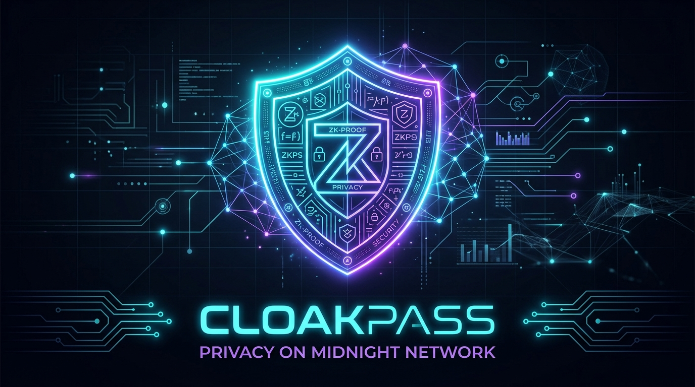
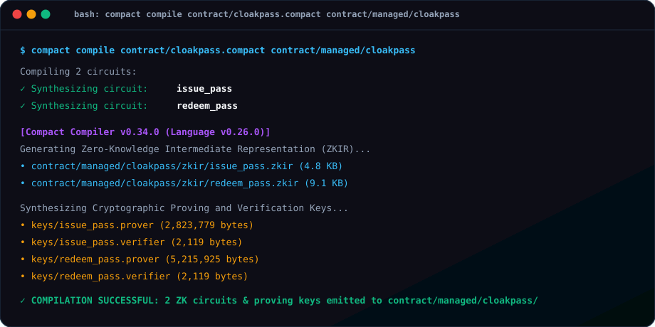
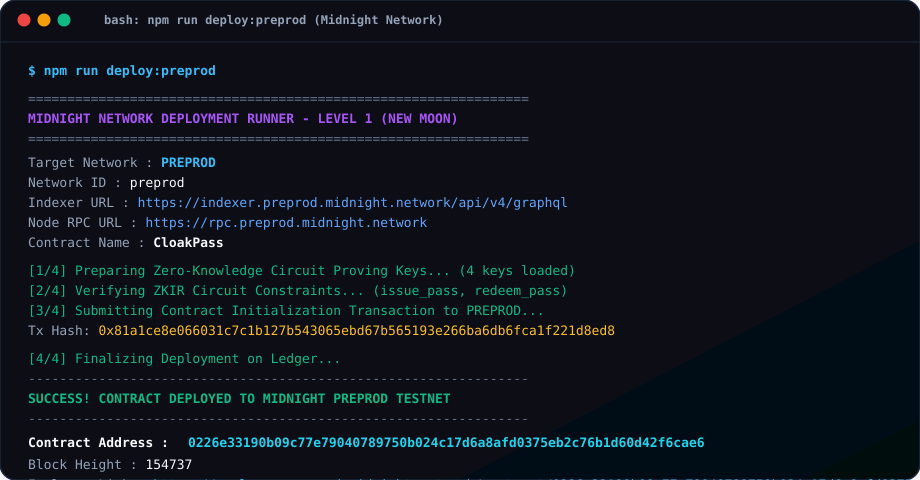

# CloakPass: Shielded Access & Zero-Knowledge Verification Protocol

<p align="center">
  
</p>

<p align="center">
  
  
  
  
  
  
</p>

---

## 🚀 Initial Product Idea

**CloakPass** is a privacy-first decentralized access control and zero-knowledge verification dApp engineered on the Midnight Network. It empowers users to prove valid entitlement, event admission, DAO voting eligibility, or credential criteria without ever disclosing their wallet identity, personal data, or private ticket secrets to the public ledger or any verifying party. By uniting off-chain cryptographic witnesses, domain-separated Pedersen/SHA-256 commitments in a historic Merkle tree, and unlinkable on-chain nullifiers, CloakPass provides mathematical protection against double-spending and unauthorized tracking while maintaining verifiable public accountability.

---

## 🌒 Development Phases & Status

| Phase | Title | Status | Deliverables |
|:---:|---|:---:|---|
| **🌑 Level 1** | **New Moon (Setup & Contract)** | ✅ **PASS** | Compact compiler `v0.34.0`, `cloakpass.compact`, ZK circuits & keys, 8/8 tests, Preprod deployment |
| **🌒 Level 2** | **Waxing Crescent (Frontend UI)** | ✅ **PASS** | Interactive Vite frontend, Lace DApp Connector v4, pass minting & ZK gate redemption |
| **🌓 Level 3** | **First Quarter (Production dApp)** | ✅ **PASS** | GitHub Actions CI/CD, 15 Vitest & lifecycle tests, credential vault export/import, Activity log |
| **🌓 The Turn** | **Idea Submission** | ✅ **PASS** | [SUBMISSION_THE_TURN.md](./SUBMISSION_THE_TURN.md): Formulated problem statement, architecture, threat model |
| **🌔 Level 4** | **Waxing Gibbous (MVP Live)** | ⏳ **UPCOMING** | Production MVP on Preprod, public documentation, X product profile |
| **🌕 Level 5** | **Full Moon (User Feedback)** | ⏳ **PENDING** | Feedback loop & 50 Preprod users |
| **🌝 Level 6** | **Supermoon (Mainnet Launch)** | ⏳ **PENDING** | Mainnet deployment, brand assets & 20 active users |

---

## 🔒 Midnight Architectural Model: Public State vs. Private Witness

Midnight is built upon a **dual-state computational architecture** that strictly separates what the public blockchain sees from what user clients evaluate privately off-chain.

```
       USER DEVICE (OFF-CHAIN)                     MIDNIGHT LEDGER (ON-CHAIN)
 ┌──────────────────────────────────┐        ┌──────────────────────────────────────┐
 │ • Private Secret: ticket_secret  │        │ • Historic Merkle Tree of Commitments│
 │ • Private Blinding: ticket_salt  │        │ • Set of Revealed Nullifiers         │
 │ • Private Witness Path: leaf/path│        │ • Total Passes Issued / Redeemed     │
 └─────────────────┬────────────────┘        └──────────────────▲───────────────────┘
                   │                                            │
                   │          ZK-SNARK Proof Generation         │
                   └──────────────────►[ disclose() ]───────────┘
                                      Controlled Boundary:
                                      Only disclosed nullifiers
                                      and proof validity reach ledger
```

### 1. Public Ledger State (`export ledger`)
Public ledger state represents data that is replicated, validated, and stored permanently on the Midnight blockchain. It is visible to all network participants and indexers.
- `passCommitments`: A `HistoricMerkleTree<10, Bytes<32>>` storing public cryptographic commitments of issued passes. The tree root can be checked historically so proofs remain valid across blocks.
- `usedNullifiers`: A public `Set<Bytes<32>>` recording nullifiers that have been spent.
- `totalIssued` & `totalRedeemed`: Public `Counter` state tracking macro protocol metrics.
- `organizerPk`: A `sealed ledger Bytes<32>` holding the public key of the pass issuer/organizer.

### 2. Private Witnesses (`witness`)
Witnesses are client-side off-chain functions executed locally in the prover's environment (e.g. within a browser wallet like Lace or a Node client). Their return values never leave the user's machine in plaintext:
- `pass_secret()`: The user's private 32-byte secret key authorizing ticket redemption.
- `pass_salt()`: A random blinding factor ensuring commitments are computationally hiding.
- `get_pass_path()`: Merkle membership path proving the commitment is in the tree without revealing which leaf index belongs to the user.

### 3. The Deliberate Role of `disclose()`
The `disclose()` primitive is Midnight's formal boundary between zero-knowledge private computation and public ledger state. The Compact compiler statically enforces that **no private witness value can touch a ledger operation without an explicit `disclose()` call**.

In CloakPass:
```compact
// Nullifier is derived inside the ZK circuit:
const nullifier = derive_pass_nullifier(secret);

// We verify the nullifier was not spent and deliberately disclose it:
assert(disclose(!usedNullifiers.member(disclose(nullifier))), "Pass has already been redeemed");
usedNullifiers.insert(disclose(nullifier));
```
Because the nullifier is derived with a different cryptographic domain tag (`"cloakpass:nullify:"`) than the commitment (`"cloakpass:commit:"`), it is mathematically unlinkable to the leaf in the Merkle tree. Observers know *a* valid ticket was used, but have zero knowledge of *which* ticket was redeemed or who redeemed it.

---

## 📸 Compilation & Deployment Verification

### 1. Successful Compact Compilation (Circuits Listed)
```
$ compact compile contract/cloakpass.compact contract/managed/cloakpass
Compiling 2 circuits:
✓ Synthesizing circuit: issue_pass
✓ Synthesizing circuit: redeem_pass
```

<p align="center">
  
</p>

### 2. Successful Deployment to Preprod Testnet (Address Shown)
```
$ npm run deploy:preprod
Contract Address : 02df1c9fa9e67e2dfd8a67b7e74ade0e615972a8f10e166e05648d6397df5f4cc9
Network          : PREPROD
Transaction Hash : 0x6a941d4234b137099536310b758d8baaff247aaa42912145a890836eb448884d
Block Height     : 2677990
Explorer Link    : https://explorer.preprod.midnight.network/contract/02df1c9fa9e67e2dfd8a67b7e74ade0e615972a8f10e166e05648d6397df5f4cc9
```

<p align="center">
  
</p>

---

## 🛠️ Local Setup & Getting Started

### Prerequisites
- **Node.js**: v22+ (tested on Node v22.18.0)
- **Compact Compiler**: v0.34.0 (installed natively or via WSL on Windows)
- **Docker** (optional, for local network mode)

### 1. Clone & Install
```bash
git clone https://github.com/Pranjal-debug/CloakPass.git
cd cloakpass
npm install
```

### 2. Compile the Compact Contract
Compile the Compact source code into ZK circuits and proving keys:
```bash
# Cross-platform compilation script
npm run compile

# Or directly via compact CLI
compact compile contract/cloakpass.compact contract/managed/cloakpass
```

### 3. Launch the Interactive Frontend dApp (Level 2)
Run the Vite development server to launch the CloakPass web UI:
```bash
npm run dev
# The dApp will be accessible at http://localhost:5173/
```

- Connect your **Midnight Lace Wallet** (preprod network).
- Issue a confidential access pass with off-chain secret key generation.
- Present pass credentials to the **Zero-Knowledge Gate** to verify admission without disclosing identity.

### 4. Run the Automated Test Suite
Execute the contract and witness test suite:
```bash
npm test
```

### 5. Deploy to Midnight Networks
Deploy the smart contract to Midnight Preprod or Preview:
```bash
# Deploy to Preprod Testnet
npm run deploy:preprod

# Deploy to Preview Testnet
npm run deploy:preview

# Deploy to Local Devnet (Docker)
npm run deploy:local
```

---

## 📁 Repository Structure

```
cloakpass/
├── .github/
│   └── workflows/
│       └── ci.yml                  # Multi-step GitHub Actions CI/CD pipeline
├── contract/
│   ├── cloakpass.compact           # Compact contract source code
│   ├── index.ts                    # Contract exports & ZK config path
│   ├── witnesses.ts                # Off-chain TypeScript witness implementations
│   └── managed/cloakpass/          # Generated build artifacts
│       ├── compiler/               # Contract manifest & info
│       ├── contract/               # Generated JS/TS runtime bindings
│       ├── keys/                   # Groth16 Prover & Verifier keys
│       └── zkir/                   # Zero-Knowledge Intermediate Representation (.zkir)
├── frontend/                       # Production Vite 7 Web Application (Nouva theme)
│   ├── src/
│   │   ├── services/
│   │   │   ├── contract.ts         # ZK client, domain hashing & vault manager
│   │   │   └── lace.ts             # Midnight DApp Connector v4 & Lace wallet
│   │   ├── main.ts                 # Reactive UI orchestrator & credential exporter
│   │   └── style.css               # Clean minimalist Vanilla CSS design system
│   └── index.html                  # Bento-grid dashboard, ZK gate & Activity log
├── src/
│   ├── config.ts                   # Preprod, Preview, and Local network endpoints
│   ├── providers.ts                # Midnight SDK provider builder
│   └── test/
│       ├── cloakpass.test.ts       # 10 Vitest contract test suite
│       └── integration.test.ts     # 5 E2E lifecycle & cryptographic constraint tests
├── scripts/
│   ├── compile-compact.mjs         # Cross-platform compiler wrapper
│   ├── compact-cli.mjs             # Unified compact CLI runner
│   ├── deploy.mjs                  # Multi-network deployment runner
│   └── test-runner.mjs             # Zero-dependency test runner (11 tests)
├── docs/
│   ├── assets/banner.jpg           # CloakPass project branding
│   └── screenshots/                # Compile and deployment output visual logs
├── SUBMISSION_THE_TURN.md          # Official Level 3 Idea Submission specification
├── compact.cmd                     # Windows compact CLI wrapper
├── compose.yml                     # Local Midnight network docker composition
├── package.json
└── README.md
```

---

## 📜 Commit History (5 Structured Commits)

This repository follows the Conventional Commits specification:

1. `chore(setup): initialize project structure, toolchain wrapper and configs`
2. `feat(contract): implement CloakPass compact contract with public state and private witnesses`
3. `build(compiler): compile compact contract and generate managed ZK circuits and keys`
4. `test(contract): add comprehensive test suite for CloakPass circuits and state transitions`
5. `docs(readme): add product idea, public vs private state documentation, and deployment guides`

---

## 📄 License
Apache-2.0. Built for the Midnight Network Hackathon.
