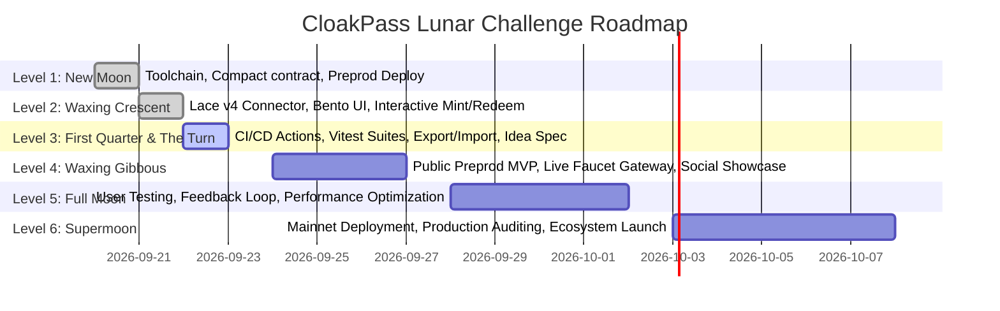

# CloakPass — The Turn: Idea Submission & Architectural Specification

**Phase**: Level 3 (First Quarter) — Idea Submission ("The Turn")  
**Project Name**: CloakPass  
**Track**: Privacy-Preserving Applications on Midnight  
**Selected Problem Statement**: *Privacy-Preserving Access Control & Sybil-Resistant Verification (Proof of Entitlement Without Identity Exposure)*  
**Live Preprod Contract**: `02df1c9fa9e67e2dfd8a67b7e74ade0e615972a8f10e166e05648d6397df5f4cc9`  
**Live Demo Application**: [https://cloak-pass.vercel.app/](https://cloak-pass.vercel.app/) (GitHub Pages: [https://pranjal-debug.github.io/CloakPass/](https://pranjal-debug.github.io/CloakPass/))  
**GitHub Repository**: [https://github.com/Pranjal-debug/CloakPass](https://github.com/Pranjal-debug/CloakPass)

---

## 1. Executive Summary & Problem Formulation

In contemporary Web3 ecosystems, access control, ticketing, and gated access rely on public non-fungible tokens (NFTs) or account-based whitelists. While transparent ledgers guarantee non-repudiation, they introduce severe privacy vulnerabilities:

1. **Surveillance & Doxxing**: Presenting a public wallet address to claim event admission, enter private spaces, or access confidential resources permanently connects the user's real-world physical location or off-chain identity with their complete financial transaction history.
2. **Transferability & Ticket Scalping**: Simple cryptographic signatures or public tokens allow illicit ticket resale, credential pooling, and credential sharing across unverified parties.
3. **Sybil Attacks in Gated Communities**: Without revealing personal identifiers, existing chains struggle to prevent single entities from claiming multiple voting rights, token distributions, or private allowances.

### The CloakPass Solution

**CloakPass** is a production-grade, zero-knowledge access pass and entitlement verification protocol natively constructed on the **Midnight Network**. 

CloakPass enables users to prove valid entitlement (e.g. event admission, DAO voting membership, API entitlement) **without revealing their identity, their wallet address, or which specific ticket in the registry they own**. By leveraging Midnight's Compact smart contract language, client-side zero-knowledge proofs (ZKPs), and cryptographic single-use nullifiers, CloakPass eliminates double-redemption while preserving absolute anonymity.

---

## 2. Technical Architecture & Cryptographic Mechanics

CloakPass implements Midnight's dual-state execution model, creating an impenetrable barrier between client-side private witnesses and public ledger state.

```
+-------------------------------------------------------------------------------+
|                             CLIENT PROVER (Off-Chain)                         |
|                                                                               |
|  [ Private State: pass_secret, pass_salt ]                                    |
|         │                                                                     |
|         ├───> SHA-256("cloakpass:commit:" || secret || salt) = Commitment Leaf │
|         │                                                                     |
|         ├───> Query Merkle Membership Path in Ledger passCommitments Tree     |
|         │                                                                     |
|         └───> SHA-256("cloakpass:nullify:" || secret) = Single-Use Nullifier  |
|                                                                               |
|  [ ZK Prover Engine: Synthesizes ZKIR Circuit Proof without Revealing Secret] |
+───────────────────────────────────────┬───────────────────────────────────────+
                                        │
                                        │ disclose(nullifier, true)
                                        ▼
+-------------------------------------------------------------------------------+
|                         MIDNIGHT LEDGER (On-Chain / Preprod)                  |
|                                                                               |
|  • passCommitments : HistoricMerkleTree<10, Bytes<32>>                        |
|  • usedNullifiers  : Set<Bytes<32>> (Single-Use Spend Registry)              |
|  • totalIssued     : Counter (Public Metric)                                  |
|  • totalRedeemed   : Counter (Public Metric)                                  |
|  • organizerPk     : Bytes<32> (Access Authority)                             |
|                                                                               |
|  Constraint Checks:                                                           |
|  1. Merkle Membership verified against root history (Depth 10 = 1,024 leaves)  |
|  2. assert(!usedNullifiers.member(nullifier), "Double-Redemption Prohibited") |
|  3. usedNullifiers.insert(nullifier)                                          |
+-------------------------------------------------------------------------------+
```

### Mathematical Definitions

1. **Commitment Derivation (Off-chain)**:
   $$\text{Commitment} = \mathcal{H}_{\text{domain}}(\text{"cloakpass:commit:"} \parallel \text{secret} \parallel \text{salt})$$
   - $\text{secret} \in \{0, 1\}^{256}$: Cryptographically secure 32-byte witness held strictly in local browser memory.
   - $\text{salt} \in \{0, 1\}^{256}$: Blinding factor preventing rainbow-table precomputations.
   - The commitment is inserted as a leaf into the on-chain Merkle tree `passCommitments`.

2. **Zero-Knowledge Membership Verification**:
   The circuit proves in zero knowledge that:
   $$\exists \, \text{path} \quad \text{s.t.} \quad \text{MerkleVerify}(\text{root}, \text{Commitment}, \text{path}) = 1$$
   The verifier and public ledger learn that a valid pass exists within the tree, but cannot discern the leaf index, position, or holder identity.

3. **Unlinkable Single-Use Nullifier Derivation**:
   $$\text{Nullifier} = \mathcal{H}_{\text{domain}}(\text{"cloakpass:nullify:"} \parallel \text{secret})$$
   - By using distinct domain separation prefixes (`"cloakpass:commit:"` vs. `"cloakpass:nullify:"`), the nullifier cannot be mathematically linked back to the original commitment leaf.
   - The contract verifies:
     $$\text{Nullifier} \notin \text{usedNullifiers}$$
     $$\text{usedNullifiers} \leftarrow \text{usedNullifiers} \cup \{\text{Nullifier}\}$$
   - Any second redemption attempt with the same credential produces an identical nullifier, causing the smart contract assertion to abort instantly.

---

## 3. Real-World Market Applications

| Target Sector | Existing Failure Mode | CloakPass Solution |
| :--- | :--- | :--- |
| **High-Profile Web3 Summits & Conferences** | Public wallet scanning exposes attendee net worth, active balances, and travel patterns. | Attendees verify tickets at gates with 1-click ZK proofs. Gatekeeper sees green light; attendee wallet stays anonymous. |
| **Private DAO Governance & Anonymous Voting** | On-chain token-weighted voting links voting intent to publicly identified wallet addresses. | CloakPass nullifiers serve as single-use anonymous ballots; validates token tier membership with zero voter de-anonymization. |
| **Whistleblower & Journalist Portals** | Access logs compromise source identity and physical IP location. | Journalists prove organizational press pass authorization without revealing name, credential number, or affiliation. |
| **Decentralized Physical Infrastructure (DePIN)** | Device telemetry tied to billing accounts leaks home addresses. | Gate sensors authenticate device authorization without tracking location histories. |

---

## 4. Product Roadmap: Phase Progression



- **Level 1 (New Moon) [COMPLETED]**: Compact contract written, compiled ZKIR & proving keys (`issue_pass.prover`, `redeem_pass.prover`), deployed to Midnight Preprod (`02df1c9fa...`).
- **Level 2 (Waxing Crescent) [COMPLETED]**: Full frontend with Midnight DApp Connector v4 & Lace wallet integration, Nouva-inspired aesthetics, local witness proving.
- **Level 3 (First Quarter & The Turn) [CURRENT]**: Multi-step GitHub Actions CI/CD, 15 unit and integration tests, JSON credential export/import backup, official idea submission.
- **Level 4 (Waxing Gibbous)**: Public hosted MVP, end-to-end user onboarding with faucet guidance, public product profile.
- **Level 5 (Full Moon)**: User testing feedback loop, batch issuance for enterprise organizers, gas and proving speed optimizations.
- **Level 6 (Supermoon)**: Midnight Mainnet deployment, formal verification of Compact constraints, production ecosystem partnerships.

---

## 5. Security & Threat Modeling

1. **Front-Running & Relayer Snooping**:
   Because transaction payloads contain only the zero-knowledge proof and disclosed nullifier (never the witness secret or salt), network validators or relayers cannot extract credentials or mint fraudulent nullifiers.
2. **Sybil Resistance**:
   Each valid pass is bound to exactly one leaf. Each leaf corresponds to exactly one deterministic nullifier. A single user holding one ticket cannot generate two distinct nullifiers.
3. **Historical Root Protection**:
   The contract utilizes `HistoricMerkleTree<10, Bytes<32>>`. Even if new passes are concurrently issued while a user is generating a proof offline, the historic root validator accepts roots from previous recent epochs, preventing stale proof race conditions.
